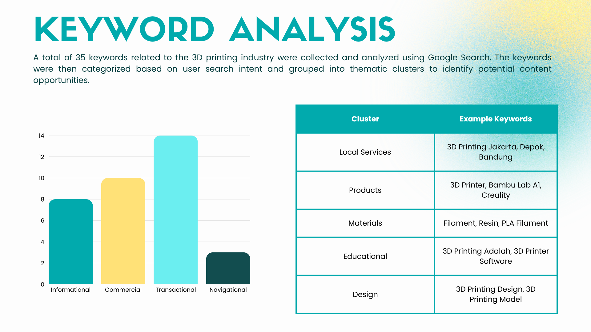
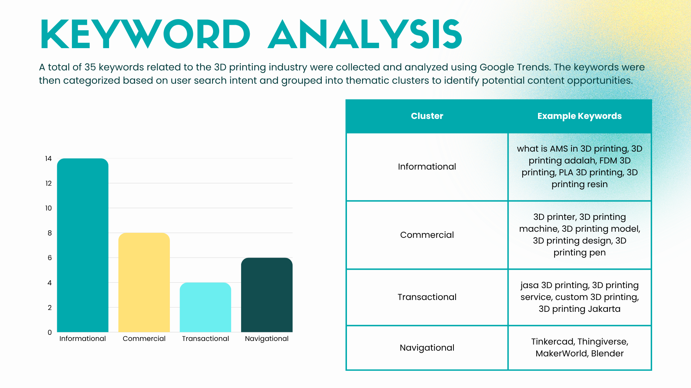
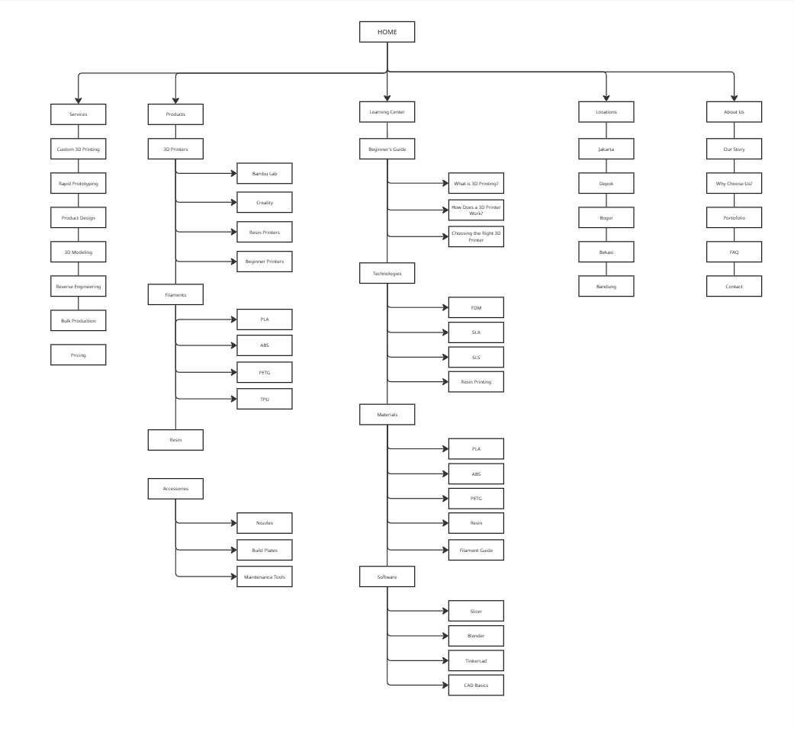

## SEO Keyword Research & Content Strategy for a 3D Printing Service Website

## Overview

As the demand for 3D printing services continues to grow, businesses need websites that are easy to discover through search engines and provide information that matches user needs. Understanding what users search for is an important first step in building an effective website structure.

This project explores keywords related to 3D printing services, analyzes user search intent, and proposes a website structure and content strategy based on the findings.

---

## Objectives

- Conduct keyword research
- Analyze search intent
- Create keyword clusters
- Develop content recommendations
- Design an SEO-friendly sitemap

---

## Tools

- Google Search
- Google Trends
- Google Sheets
- Canva

---

## Workflow

Keyword Collection

↓

Search Intent Analysis

↓

Keyword Clustering

↓

Content Recommendations

↓

Website Sitemap

---

## Deliverables

- Keyword Research Dataset
- Search Intent Analysis
- Keyword Clusters
- SEO Recommendations
- Proposed Website Sitemap

---

## Keyword Analysis: Google Search

## Keyword Analysis: Google Trend

## Analysis
The keyword analysis from Google Search and Google Trends indicates that users search for 3D printing-related information with different objectives. Informational keywords dominate the search landscape, suggesting that many users are looking to understand 3D printing concepts, technologies, materials, and software before making any purchasing decisions. At the same time, commercial and transactional keywords demonstrate a growing interest in comparing products, exploring service providers, and searching for location-based 3D printing services.

The findings also reveal that users search across multiple stages of the customer journey, from learning about 3D printing, researching products and services, to finding a provider for custom printing. Therefore, an effective website should not only offer service pages but also include educational content, product-related information, and location-specific landing pages to address different user needs and search intents

## SEO RECOMMENDATIONS 
Based on the analysis, the proposed website should include:
- Service Pages for 3D printing services and custom orders.
- Location-Based Landing Pages targeting cities with high search demand (e.g., Jakarta, Depok, Bandung).
- Educational Blog covering 3D printing concepts, materials, technologies, and beginner guides.
- Product Pages for 3D printers, materials, and accessories.
- Comparison & Buying Guides to support users during the product research stage.

## SITEMAP SUGGESTION 

